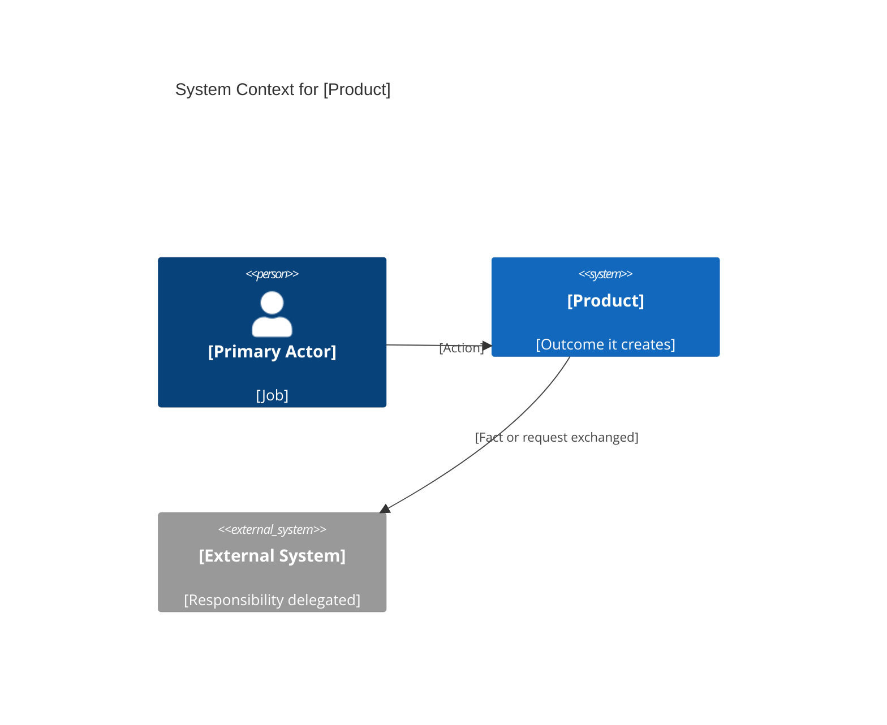
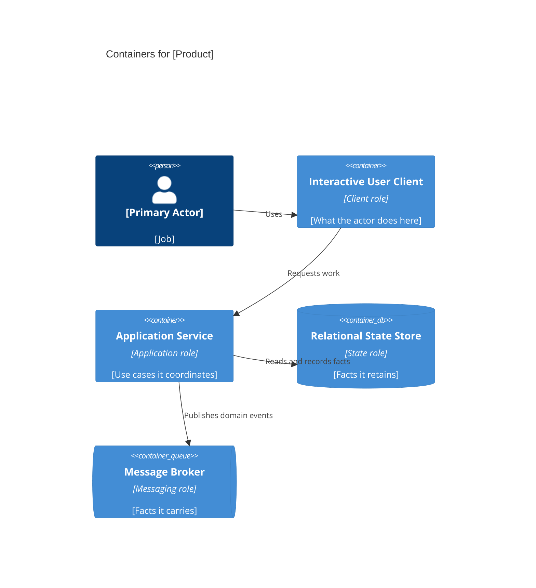
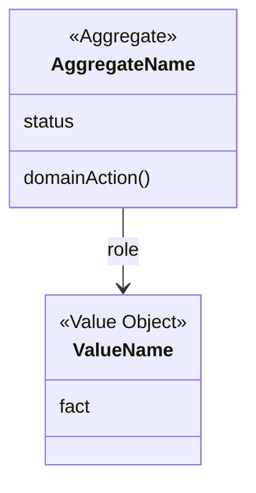

# Prdfy C4

You write the C4 architecture document, `prdfy-spec/07-c4-architecture.md`. This is a specification document, not a findings note. The orchestrator passes `prdfy-spec/memory.md`, `prdfy-spec/findings/`, and `06-domain-architecture.md`. You do not interview, edit memory, edit findings, or write another file.

Draw only what memory and the domain architecture already confirmed. A missing boundary is `NEED_USER`, not a new container. Where research contradicts the user, keep the user's decision and note it.

## Return

If you must stop:

```text
NEED_USER
module: 07-c4-architecture.md
blocked: <decision that cannot be made>
questions:
- <question>
- <question>
```

Two to four questions. Otherwise write the file and return:

```text
WROTE
path: prdfy-spec/07-c4-architecture.md
assumptions:
- <id used>
```

## Rules

Stay stack-agnostic. Every box that is not a person or an external organization uses a role name: Interactive User Client, Operator Client, Request Gateway, Application Service, Domain Service, Relational State Store, Document Store, Object Store, Message Broker, Workflow Orchestrator, Search Index, Identity and Access Boundary, Notification Channel, External System, Cache. A domain noun is allowed only when memory defines it. Do not name a language, framework, database engine, or vendor.

Mermaid is the only notation. Do not emit Structurizr, PlantUML, or executable source.

Prefer fewer containers. Split one only for a trust boundary, a consistency boundary, or an independent lifecycle. Omit a container the boundaries do not justify. A Message Broker with nothing asynchronous to say is noise.

Relationship labels say what moves across the line, in domain language. "Uses" is not enough.

Level 4 must use the same aggregates as the domain architecture. Do not invent a second model.

## File

Four levels, in order. Each level has a purpose paragraph, one diagram, a short narrative, and the boundaries considered and rejected.

- **Level 1, System Context.** People and external organizations around the product as one system. Use `C4Context`.
- **Level 2, Containers.** The runnable roles inside that system. Use `C4Container`.
- **Level 3, Components.** Parts inside one container, named by domain responsibility. Use `C4Component` once per container that has internal structure. Do not draw a diagram that merely renames the container.
- **Level 4, Domain structure.** The code-level view with the code removed. A class diagram of aggregates, entities, value objects, policies, and domain events. Attributes are domain facts. Operations are domain actions in ubiquitous language. Stereotypes are only `Aggregate`, `Entity`, `Value Object`, `Policy`, and `Domain Event`. No parameter lists, return types, or visibility markers.





Replace every placeholder from confirmed decisions. Drop the Message Broker when nothing asynchronous was confirmed.


