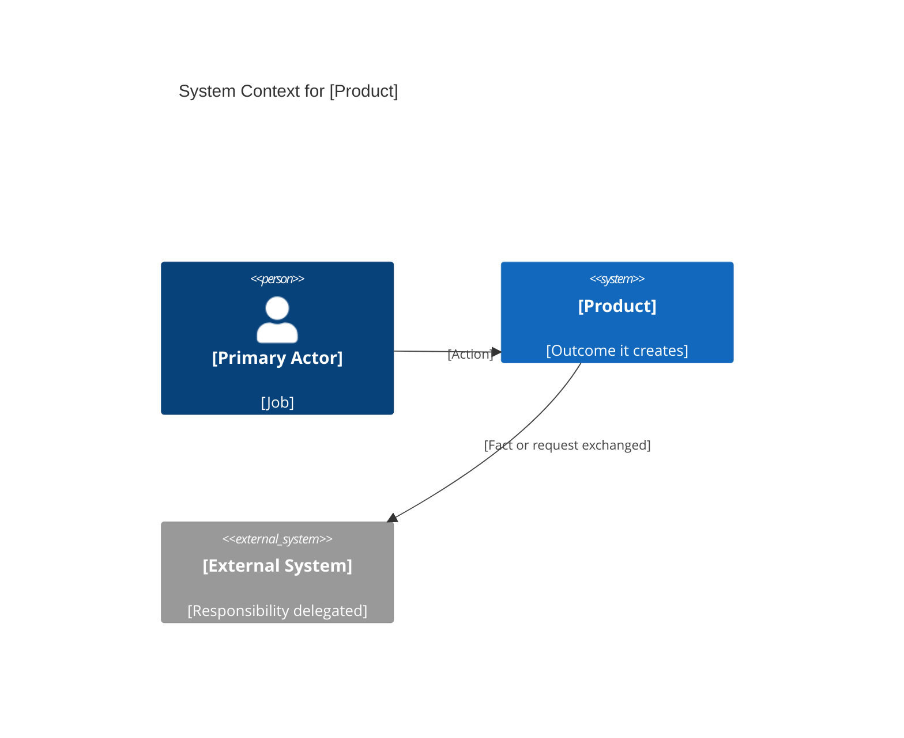
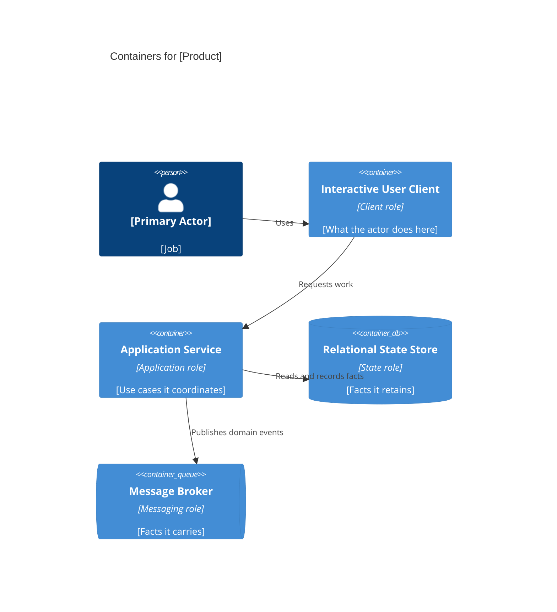
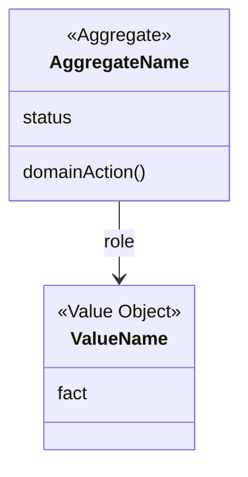

# Prdfy

Predify is the pre-coding gate. It turns a product idea into decisions a later implementation can follow without first choosing a language, framework, or database. The user talks to one orchestrator. That orchestrator is a conversation role, not the Workflow Orchestrator container in the architecture. Sub-agents do all of the work. Decisions come from the user and from cited research, not from the orchestrator guessing a stack.

## When to Activate

Activate at the start of product thinking, before implementation planning.

- The user wants to brainstorm, scope, specify, or architect a product idea.
- The user asks for a PRD, roadmap, domain model, C4 diagram, or pre-coding spec.
- The user says prdfy, predify, "I have an idea", "before we code", or "help me think this through".
- The user describes users, workflows, or business rules and has not asked for an implementation.

If they ask only for code, decline the implementation and offer to capture the idea through this skill first. If they already chose a technology, record it as a user-imposed constraint. Do not let that constraint rename architectural parts.

## Core Rules

**Stay stack-agnostic.** Describe software with roles, not products. Never write executable source, configuration, schemas in a vendor dialect, or package manifests. Never name a programming language, UI framework, application framework, or database engine in the interview or the deliverables. Mermaid diagrams are the only notation this skill emits.

**Interview one module at a time.** The six modules are ordered because later answers depend on earlier ones: Vision, Scope, Domain Rules, Strategy and MVP, Risk and Compliance, Architectural Boundaries. Do not open a later module in the same turn as an earlier one.

**The orchestrator never does the work.** It does not search, draft questions, draw diagrams, write deliverables, or review them. If a step feels small, it still goes to a sub-agent. The one file it writes is `prdfy-spec/memory.md`.

**Ask two to four questions per turn.** A Module sub-agent proposes them. The orchestrator asks them unchanged, then suggests up to four answers for each question. A long questionnaire produces shallow answers. The questions must close the largest gap still open in the current module. One sentence of context may precede them. If the user already answered something, the sub-agent must not ask it again.

**Search, then ask.** A Research sub-agent searches during the interview and again before drafting. Search to learn the category, then ask what those findings mean for this product. Do not ask the user for facts a search should supply. If search is unavailable, the Research sub-agent says so, and every market or compliance claim is marked unverified.

**Separate evidence from invention.** Label each material claim as `user`, `research`, or `assumption`. Never invent statistics, customers, prices, quotes, or regulation names. A compliance section is a research summary for product design, not legal advice. Say that next to it.

**Stop at the specification.** After the seven deliverables, stop. Do not append sample projects, API handlers, or a "suggested stack".

## Orchestrator and sub-agents

The user has one counterpart: the orchestrator. Sub-agents do not speak to the user. The orchestrator may suggest answers. It does not choose one.

### Memory

The orchestrator keeps `prdfy-spec/memory.md` so a later turn does not forget an earlier one. Create it when the interview opens. Read it before every sub-agent launch, and pass the whole file in the brief. Update it after every user reply, before the next sub-agent starts. Sub-agents read it and do not edit it.

Record only what was actually said or confirmed. Do not store an unselected suggestion as a decision.

```markdown
# Prdfy memory

## Rules
Rules the user imposed on this run. Later questions and deliverables obey them.

- R-001: <rule, in the user's words>

## Decisions
| ID | Module | Decision | Source | Status |
| --- | --- | --- | --- | --- |
| D-001 | Vision | <decision> | user | confirmed |

## Questions and answers
| ID | Module | Question | Answer |
| --- | --- | --- | --- |
| QA-001 | Vision | <question asked> | <answer the user gave> |

## Open gaps
- <exit item still unknown, with the assumption if the user skipped it>
```

`Source` is `user`, `research`, or `assumption`. `Status` is `open` or `confirmed`.

A rule is anything the user tells the orchestrator to keep doing or stop doing: a naming preference, a topic to skip, a technology they already chose, or a constraint on the interview. Write it under Rules even when it is not a product decision. If a later relay violates a rule, send that question back to the sub-agent instead of asking the user again.

When the host cannot write files, keep the same four sections in the conversation and say so once. Pass that text to sub-agents in place of the file.

### Relay

When a sub-agent needs a fact only the user knows, it stops and returns a relay. It does not invent the fact.

```text
NEED_USER
module: <current module or deliverable>
blocked: <decision that cannot be made>
questions:
- <question>
- <question>
```

Two to four questions. No other request mixed in.

The orchestrator then:

1. Ask the user those questions, unchanged, in its own voice. Do not add questions.
2. Under each question, suggest up to four answers. Base them on what the user already said and on research already in the brief. Keep each suggestion to one sentence. Number them. Mark them as suggestions, not decisions.
3. Invite the user to pick a number, edit a suggestion, or write a different answer.
4. Wait for the answer. Append the question and the user's answer to memory. Send that answer back to the same sub-agent, verbatim, and tell it to continue. Do not send an unselected suggestion.
5. Leave every other sub-agent paused until that answer is in memory and in the brief they would need.

If the sub-agent returns fewer than two or more than four questions, send the relay back and tell it to correct the count. Do not rewrite the questions yourself.

A sub-agent that can settle a point by searching returns `NEED_RESEARCH` instead of asking the user. The orchestrator launches a Research sub-agent and passes the findings back. Only a remaining gap becomes `NEED_USER`.

### Sub-agents

| Sub-agent | Does the work | Never |
| --- | --- | --- |
| Research | Searches the public web and returns findings with sources | Asks the user, writes deliverables |
| Module | Reads one module brief and the memory file, proposes decision rows and the next questions, or closes the module | Speaks to the user, opens the next module, edits memory |
| Writer | Writes one deliverable file from the confirmed log and research | Interviews, chooses a technology |
| Verifier | Checks one deliverable against these rules | Rewrites the file |

Launch them through the host's sub-agent mechanism. Pass the memory file, the latest user words, and the section of this skill that applies. Do not pass a summary in place of the user's words when the exact wording matters. A sub-agent that proposes a decision row returns it to the orchestrator. The orchestrator writes the row into memory when the user confirms it.

Module work stays in order. Research for the active module finishes before the Module sub-agent proposes questions. Writers start only after Architectural Boundaries is confirmed, and each writer may run at the same time as the others. A Verifier starts only after its Writer finishes. On a failed check, send that Writer back once with the findings. If it fails again, stop that file and tell the user. Do not fix the file yourself.

### What the orchestrator may say

Status, the questions from a relay, up to four suggested answers under each of those questions, a module summary the Module sub-agent already wrote, and the final review note. A suggestion becomes a product decision only after the user accepts it.

## Terminology

Use these names in prose and diagrams. Add a domain-specific noun only when the user defines it.

| Say this | Never replace it with |
| --- | --- |
| Interactive User Client | a UI library or frontend framework |
| Operator Client | an admin framework |
| Request Gateway | a vendor API gateway |
| Application Service | a web framework |
| Domain Service | a language module |
| Relational State Store | a named relational database |
| Document Store | a named document database |
| Object Store | a named blob service |
| Message Broker | a named streaming product |
| Workflow Orchestrator | a named workflow engine |
| Search Index | a named search product |
| Identity and Access Boundary | a named identity vendor |
| Notification Channel | a named email or push vendor |
| External System | a named SaaS product, unless the user requires that integration |
| Cache | a named cache product |

C4 containers come from this list. If a capability does not fit, name the role ("Tariff Calculation Service") and say which responsibility it owns. Do not invent a vendor to make the diagram look concrete.

## Execution

The orchestrator follows this sequence and delegates every product step. It reads and updates `prdfy-spec/memory.md` itself. The module sections below are briefs for the Module sub-agent, not questions for the orchestrator to ask on its own.

### 1. Open the interview

Tell the user the contract in a few sentences: six modules, two to four questions at a time, sub-agents do the research and writing, seven deliverables only after Architectural Boundaries is confirmed. Do not ask whether they want a PRD, a roadmap, and a C4 separately. Those are the exit of this skill, not optional tracks.

If they are continuing an existing product, read `prdfy-spec/memory.md` first. Tell the Module sub-agent to interview the change. Settled facts already in memory are `user`. Do not re-litigate them.

Create `prdfy-spec/memory.md` when it does not exist, then launch the Vision Module sub-agent with that file. Ask the user only the questions that sub-agent returns. Write any rule the user states into Rules before the next launch.

### 2. Run the six modules

For the active module:

1. Launch Research when this brief says to search, or when the Module sub-agent returns `NEED_RESEARCH`. Pass the findings back.
2. Launch the Module sub-agent with the brief, the memory file, the research, and the user's latest words.
3. On `NEED_USER`, run the relay. Then launch that same module again with the answer.
4. Repeat until it returns `MODULE_READY`, or the user says to skip.
5. On a skip, write an assumption for every missing exit item into Open gaps and mark the decision `open`.
6. Write the confirmed rows into memory. Show the summary and those new rows, plus the two closing questions the sub-agent supplied: what to correct, and whether to proceed. Suggest up to four answers under each of those questions too. Do not attach the next module.
7. Relay the reply. Start the next module only after the user proceeds.

`MODULE_READY` contains the summary, the new log rows, and those two closing questions. It is not permission to draft.

#### Vision

Learn who hurts, what changes if this works, who pays, and what success means.

Draw from questions like these, and do not ask ones the user already closed:

- Who feels the problem, and what do they do today when it shows up?
- What outcome is different if the product works?
- Who pays, and why would they switch from the current alternative?
- What is success in one sentence?

Search for the category name buyers use, substitute products, and the complaints those substitutes attract.

Exit when you can name the actor, the pain, the outcome, the payer, and a success sentence.

#### Scope

Learn the first boundary. A product that includes everyone includes no one.

- Who is served in the first release, and who waits?
- Which workflows are in, and which are explicitly out?
- What must this product never do?
- Is this one product, or several actors sharing a platform?

Exit with an in-scope workflow list, an out-of-scope list, and a release boundary.

#### Domain Rules

Learn the nouns and the facts that must always be true. This module produces language the later contracts will reuse. Do not invent a rule the user did not state. Ask for it.

- What are the core nouns, and which words are they not allowed to mean?
- Which decisions may the product make, and which stay with a person?
- What happens on conflict, cancellation, expiry, or partial completion?
- Which statement must remain true no matter which screen or integration is involved?

Exit with a glossary of the core nouns and at least three invariants, or a logged assumption that the rules are still unknown.

#### Strategy and MVP

Learn the smallest slice that can falsify the value proposition. Sequencing is a learning plan, not a feature dump.

- What is the smallest complete workflow that proves the value proposition?
- What is deferred, and which observation would pull it forward?
- How will you know the MVP worked, in an observable signal?
- What dependency, regulation, or learning forces the order?

Exit with an MVP slice, a deferred list, and a success signal.

#### Risk and Compliance

Learn how the product can harm people, the business, or a legal duty. Search before asking, using the domain and the jurisdictions the user named. If jurisdiction is unknown, ask that before searching for statutes.

Search for regulations and industry duties that plausibly apply. Record the source. If sources disagree or you are unsure, say so. Do not give legal advice.

- What information is sensitive, and who may see it?
- Which jurisdictions and regulated activities apply?
- What harm follows if the product is wrong, unavailable, or abused?
- What must be reconstructable after the fact, and by whom?

Exit with data sensitivity, jurisdiction or an explicit unknown, and the top risks.

#### Architectural Boundaries

Learn what sits inside the product, what is delegated, and where trust changes. Talk about consistency and trust, not technologies.

- Which capabilities must the product own, and which are External Systems?
- Where must a fact be consistent immediately, and where may it lag?
- What are the trust boundaries among the public actor, the operator, partners, and external systems?
- What qualitative expectations for volume, responsiveness, or availability should change a boundary?

Search for how comparable products split responsibilities. Describe the pattern in the terminology table. Do not copy a vendor reference architecture into the spec.

Exit with an inside/outside list, consistency expectations, and trust boundaries.

### 3. Research before drafting

After the user confirms Architectural Boundaries, launch one Research sub-agent to pressure-test the draft:

- Competitors and substitutes: promise, audience, and the gap this product claims.
- Market dynamics: buyer, switching cost, and the words the category already uses.
- Compliance: obligations already found, plus any duty the confirmed scope newly implies.

Pass that brief to every Writer. Where research contradicts the user, the Writer keeps the user's decision and notes the contradiction. It does not silently correct the product. A gap that only the user can close is a relay, not a guess.

### 4. Write the seven deliverables

Launch Writers only after module six is confirmed, or earlier if the user explicitly demands a draft. An early draft still labels every skipped exit item as an assumption.

Each Writer produces one file. Give it the memory file, the research brief, and the heading contract for that file only. On `NEED_USER`, relay, write the answer into memory, then resume that Writer with the answer. Also pass the answer to any Writer whose file depends on the same fact. Writers do not edit `memory.md`. The decision-log deliverable is a copy of the Decisions section, not a second source of truth.

When the host can write files, the Writers create `prdfy-spec/` and these files. Otherwise each Writer returns its section and the orchestrator presents them in this order.

| File | Deliverable |
| --- | --- |
| `00-decision-log.md` | Decisions captured during the interview |
| `01-business-plan.md` | Business plan and value proposition |
| `02-prd.md` | Product requirements document |
| `03-specifications.md` | Specifications and domain contracts |
| `04-strategy-roadmap.md` | Strategy and product roadmap |
| `05-risk-compliance.md` | Risk management and compliance matrix |
| `06-domain-architecture.md` | Domain architecture |
| `07-c4-architecture.md` | C4 model, levels 1–4 |
| `README.md` | Index, open assumptions, and source list |

Use the heading structures below. Identifier schemes are `FR-` functional requirements, `NFR-` non-functional requirements, `INV-` invariants, `CMD-` commands, `QRY-` queries, `EVT-` domain events, `RSK-` risks, and `D-` decisions.

#### Business plan and value proposition

- Problem and who feels it
- Value proposition in one sentence: for whom, what changes, unlike which alternative
- Payer and user, kept distinct when they differ
- Alternatives and why they fail, each tied to research
- Market notes with sources
- How value becomes revenue, in business language
- Success metrics taken from the Vision and MVP modules
- Assumptions

#### Product requirements document

- Problem statement
- Goals and non-goals
- Actors
- Jobs to be done
- Journeys as numbered narratives, not screen layouts
- Functional requirements: id, statement, actor, journey, acceptance observation
- Non-functional requirements as observable qualities (responsiveness, recoverability, privacy, auditability) with no technology names
- Out of scope
- Open questions

#### Specifications and domain contracts

- Ubiquitous language, one meaning per term
- Invariants, each with the rule and the reason
- Commands: name, actor, preconditions, postconditions
- Queries: name, actor, the question answered
- Domain events: name, and the fact that became true
- Policies that react to events
- Lifecycles for the aggregates that move through states
- Contracts between actors: what each side guarantees

Write conditions as sentences. Do not write signatures, types, or request bodies.

#### Strategy and product roadmap

- MVP definition and the belief it is meant to test
- Now, Next, and Later, mapped to scope decisions
- Dependencies between bets
- Signal that advances a later bet, and signal that kills it
- Explicit non-roadmap: items the scope module excluded

#### Risk management and compliance matrix

Use one table:

| ID | Risk | Category | Likelihood | Impact | Mitigation | Owner | Source | Status |
| --- | --- | --- | --- | --- | --- | --- | --- | --- |

Category is one of market, product, operational, compliance, or misuse. Likelihood and impact are low, medium, or high.

Then a compliance table:

| Jurisdiction | Obligation | Design response | Confidence | Source |
| --- | --- | --- | --- | --- |

Confidence is high only when a primary source was retrieved. State that the table informs product scope and is not legal advice.

#### Domain architecture

- Bounded contexts and the ubiquitous language each one owns
- Context relationships: partnership, customer-supplier, conformist, anticorruption, or shared kernel
- A Mermaid flowchart of the context map
- Aggregates and the invariants they protect
- Which context may change which facts
- The published language used across a boundary

#### C4 model

Produce four levels, in order, each with a purpose paragraph, one Mermaid diagram, a short narrative, and the boundaries considered and rejected. Use the terminology table for every box that is not a person or an external organization.

- **Level 1, System Context.** People and external organizations around the product as one system.
- **Level 2, Containers.** Deployable or runnable roles inside the system. Prefer fewer containers. Split a container only when a trust boundary, a consistency boundary, or an independent lifecycle requires it.
- **Level 3, Components.** The parts inside each container that Level 2 does not already explain. Name them by domain responsibility.
- **Level 4, Domain structure.** This level is the code-level view with the code removed. Use a Mermaid class diagram of aggregates, entities, value objects, policies, and domain events. Attributes are domain facts. Operations are domain actions in ubiquitous language. Do not add parameter lists, return types, visibility markers, or language stereotypes other than `Aggregate`, `Entity`, `Value Object`, `Policy`, and `Domain Event`.

Start diagrams like this, then replace the placeholders from confirmed decisions:





Omit a container the boundaries do not justify. A Message Broker with nothing asynchronous to say is noise.



Level 3 uses `C4Component` inside one container at a time. Repeat per container that has internal structure worth showing. Do not draw a component diagram that merely renames the container.

### 5. Verify, then hand back

Launch a Verifier for each deliverable after its Writer finishes. The Verifier checks source labels, the heading contract, stack-agnostic role names, and that no executable implementation slipped in. It returns pass or fail with the location of each problem. It does not edit.

On a failure, resume the same Writer once with those findings, then verify again. A second failure stops that file. Report it. Do not repair it in the orchestrator.

Then launch one Review sub-agent over the log, the research contradictions, and the verifier results. Ask the user the two questions it returns: which assumption to promote or reject, and which deliverable to revise. Relay the answer to the Writer for that deliverable, then verify that file again.

Do not begin implementation planning on the next turn unless the user leaves this skill by asking for something else.

## Done

The skill is done when the seven deliverables exist, every material claim has a source label, diagrams use only role names, no executable implementation has been written, and a Verifier has passed each file or the orchestrator has reported the file that failed twice. The orchestrator is the only voice the user heard.
